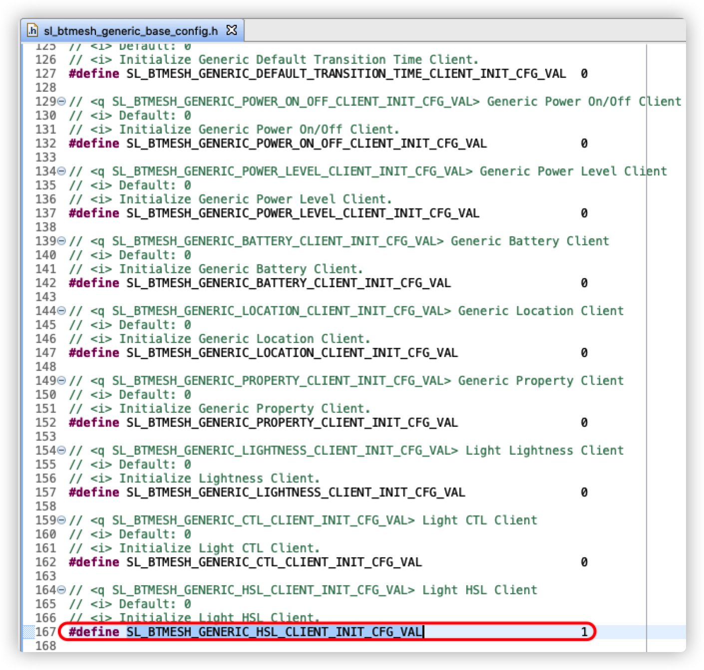

# HSL lighting

## Introduction

Lighting is BT mesh important application scenario. Here we disuss on lighting terminology and how our stack handle it.

## How We Describe Color
Nowaday, lighting is not only for ON/OFF. Most of light provide color setting.

There are 3 primary ways to describe a color.


- Hue, another word for color, degree on the color wheel from 0 to 360

  色调，整体环境下色彩的浓淡分配方面的定义
  - 0 is red
  - 120 is green
  - 240 is blue

- Saturation(chroma), the intensity or purity of a hue, is a percentage value

  饱和度/浓度
  - 0% means a shade of gray
  - 100% is the full color

- Lightness, the relative degree of black or white mixed with a given hue, is also a percentage value

  亮度
  - 0% is black
  - 50% is neither light or dark
  - 100% is white

- The 4th one is temperature, the perceived warmth or coolness of a color, measured in degrees Kelvin (K)

  色温，可以理解为宏观上的一种大的环境，是表示所包含颜色成分的一个计量单位
  - 900 kelvins: Candlelight; warm and orange-reddish in color
  - 2500 kelvins: Tungsten light; warm with orange-yellow colors
  - 3000 kelvins: Early sunrise; warm yellow color
  - 4500 kelvins: Electronic flash; transitioning from warm to cool tones
  - 5000 kelvins to 5500 kelvins: Noon sunlight; bright with mild cool hues
  - 6000 kelvins: Overcast daylight; very bright and cool
  - 10,000 kelvins: Blue sky; extremely bright and cool


## BT mesh implement
### HSL control topologic

The Bluetooth Mesh - SoC Light HSL example is a working example application that you can use as a template for Bluetooth Mesh HSL Light applications.

Currently the Bluetooth Mesh - SoC Switch does not support HSL Client (i.e. cannot set hue or saturation). So first step is rework on switch side.
### HSL switch
1) Create "Bluetooth Mesh - SoC Switch", the HW here we use xG21(BRD4181A), add HSL client model.

  

2) Check SL_BTMESH_GENERIC_HSL_CLIENT_INIT_CFG_VAL on sl_btmesh_generic_base_config.h, if not set then set it.

  
  
3) Create btmesh_hsl_client folder(/gecko_sdk_4.0.1/app/bluetooth/common/btmesh_hsl_client), then copy provided btmesh_hsl_client.c and btmesh_hsl_client.h into the folder.

  

  Configure the publish parameter as below, test code set 7 HSL combination data to show color changing.
  ```c
    //----------
      req.kind = mesh_lighting_request_hsl;
      req.hsl.hue = 65535/3;   //0 to 360, 120 is green, it take the 1/3
      req.hsl.saturation= 65535; //100%
      req.hsl.lightness = 65535/2;  //50% //sl_btmesh_get_lightness();
    //----------
      uint16_thsl_table[HSL_INDEX_MAX][3] = {
          {0,0,0},       //Off
          {0,100,50},    //Red
          {120,100,50},  //Green
          {240,100,50},  //Blue
          {39,100,50},   //Orange
          {300,76,72},   //Pink
          {248,53,58},   //Purple
      };
      target_hue = (double)hsl_table[new_hsl][0]/360*65535;
      target_saturation = (double)hsl_table[new_hsl][1]/100*65535;
      target_lightness = (double)hsl_table[new_hsl][2]/100*65535;
    //----------
  ```

4) Replace app.c file, invoke sl_btmesh_change_hsl() in app_button_press_cb()
  

### HSL light
Use default Simplicity Studio "Bluetooth Mesh - SoC HSL Light" is OK.
For checking the color change according to HSL client, the recommend HW is Thunderboard Sense 2(BRD4166A).
The light color finally is control by RGB setting, rgb_led_set().

  

### Provisioner
There is Mesh Host Provisioner C Example for NCP mode from Bluetooth Mesh 2.2.0.
SimplicityStudio/SDKs/gecko_sdk1/app/bluetooth/example_host/btmesh_provisioner

We can use it for provsion HSL light and switch.

## Test Log
Each key press on button 0 will send HSL client control message, then the light will change the color accordingly.
  